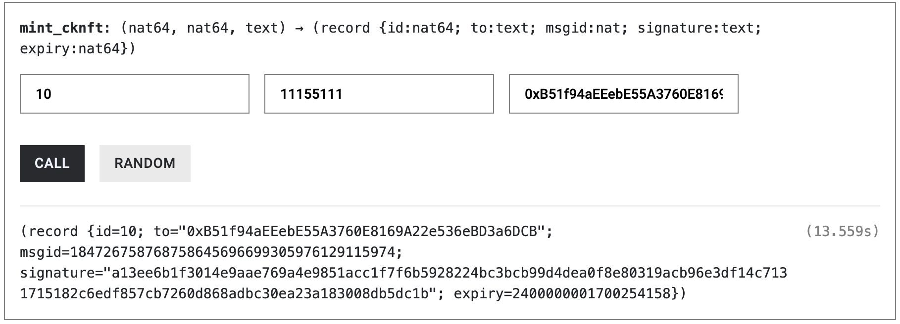
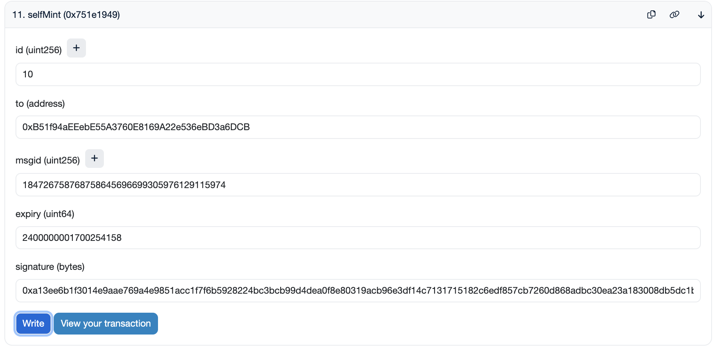
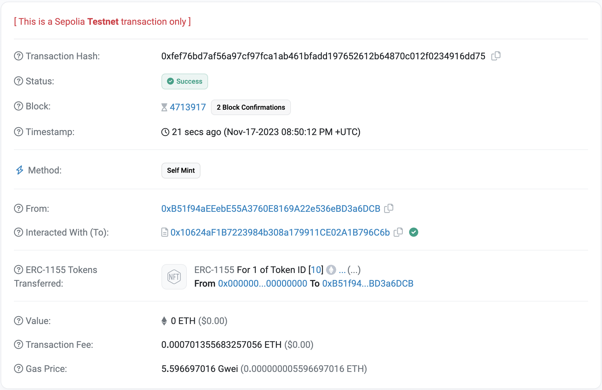
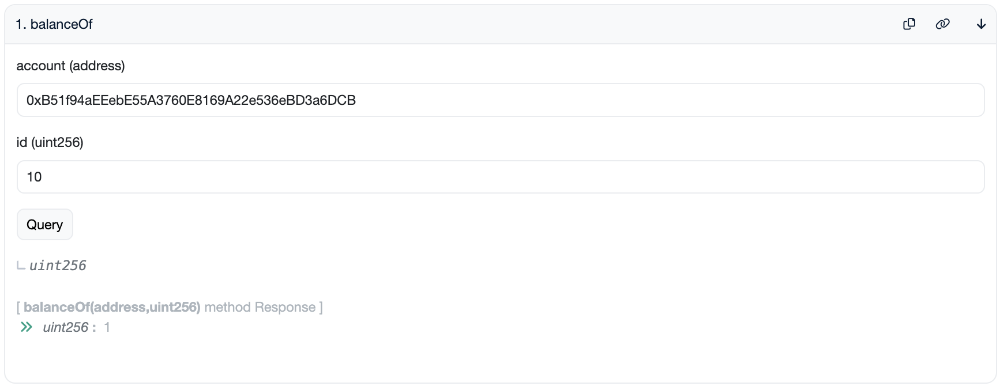
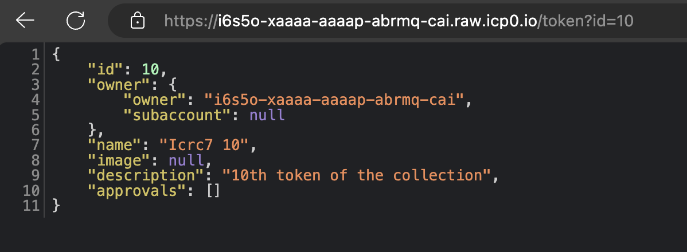

# ckNFT integration

## Problem Statement

NFT’s on ICP are superior as they store the asset data WITH the token.
However, EVM chains capture most of the trading liquidity for now.

## Our Solution

ckNFT is a direct integration of an ICRC7-based NFT wit evm blockchains such as Bitfinity or Ethereum using [ERC-1155](https://eips.ethereum.org/EIPS/eip-1155) standard.

## Prerequisites

- [DFINITY Canister SDK](https://sdk.dfinity.org/docs/quickstart/local-quickstart.html)
- [Node.js](https://nodejs.org/en/download/)
- [Rust](https://www.rust-lang.org/tools/install)
- Basic understanding of Ethereum and smart contracts

# To Reproduce:

After cloning the repository, the next step is to run the project locally to ensure everything is set up correctly. Follow the commands below based on your package manager (Yarn or npm).

### Installing Dependencies

First, let's install all the required dependencies:

```bash
yarn install:all
# or
npm run install:all
```

### Running Local Internet Computer

To start the local Internet Computer environment, run:

```bash
yarn dfx:start
# or
npm run dfx:start
```

### Deploying to the Local Internet Computer

Deploy your the backend canister to the local Internet Computer by running:

```bash
yarn deploy hello
# or
npm run deploy hello
```

### Running the Next.js App

To run the Next.js(frontend) app, execute:

```bash
yarn dev
# or
npm run dev
```

Open your browser and navigate to [http://localhost:3000](http://localhost:3000) to see your app running.

### Minting NFT

Finally, to mint the ICRC7 NFT:

```bash

# Sets minting authority
export MINTING_AUTHORITY=$(dfx identity get-principal)

# Deploys your canisters to the replica and generates your candid interface
dfx deploy icrc7 --argument '(record {
  tx_window=24;
  permitted_drift=2;
  name="Icrc7 Token";
  symbol="ICRC7";
  minting_authority=opt principal"'${MINTING_AUTHORITY}'";
  royalties=null;
  royalties_recipient=null;
  description=opt "ICRC7 Standard Token";
  image=null;
  supply_cap=null;
})'
```

```bash
# Mints token
dfx canister call icrc7 icrc7_mint '(record{
  id=100;
  name="Icrc7 100";
  description=opt "100th token of the collection";
  image=null;
  to=record{
  owner=principal"2vxsx-fae";
  subaccount=null;
  };
})'
```


### Transfer NFT

dfx canister call icrc7 icrc7_transfer '(100)'

### CKNFT

`https://a4gq6-oaaaa-aaaab-qaa4q-cai.raw.ic0.app/?id=6yxaq-riaaa-aaaap-abkpa-cai`

### Bitfinity ckNFT Contract

`https://explorer.bitfinity.network/address/0x10624aF1B7223984b308a179911CE02A1B796C6b`

### Sepolia ckNFT Contract

`https://sepolia.etherscan.io/address/0x10624aF1B7223984b308a179911CE02A1B796C6b`

you can find the deployed smart contract with this address 0x10624aF1B7223984b308a179911CE02A1B796C6b on other chain also.

### Testing





https://sepolia.etherscan.io/tx/0xfef76bd7af56a97cf97fca1ab461bfadd197652612b64870c012f0234916dd75





