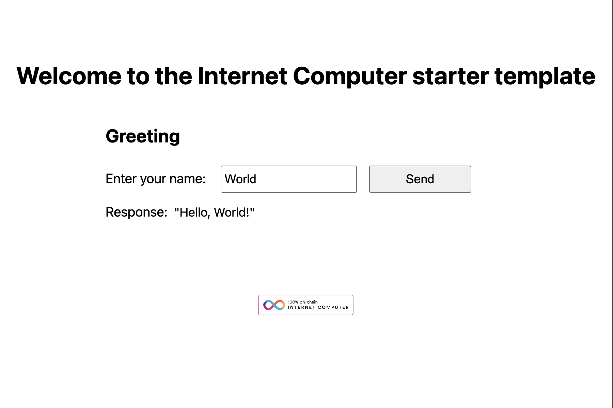

# Cross Chain NFT integration

## Problem Statement

NFT’s on ICP are superior as they store the asset data WITH the token
However, EVM chains capture most of the trading liquidity for now

## Our Solution

ckNFT is a direct integration for users to bridge ICRC7-based
NFTs flexibly to evm chains such as Bitfinity or Ethereum and to 
accept payment for them using cross chain token such as ckBTC.

## Prerequisites

- [DFINITY Canister SDK](https://sdk.dfinity.org/docs/quickstart/local-quickstart.html)
- [Node.js](https://nodejs.org/en/download/)
- [Rust](https://www.rust-lang.org/tools/install)
- Basic understanding of Ethereum and smart contracts

# To Reproduce:

## Step 1: Clone the Starter Repository

We'll begin by cloning the [`ic-rust-nextjs`](https://github.com/b3hr4d/ic-rust-nextjs) repository, which serves as our starter template.


### Cloning the Repository

To clone the repository, open your terminal and run:

```bash
git clone https://github.com/b3hr4d/ic-rust-nextjs.git
```

## Step 2: Run the Project Locally

After cloning the repository, the next step is to run the project locally to ensure everything is set up correctly. Follow the commands below based on your package manager (Yarn or npm).

### Installing Dependencies

First, let's install all the required dependencies:

```bash
yarn install:all
# or
npm run install:all
```

### Running Local Internet Computer

To start the local Internet Computer environment, run:

```bash
yarn dfx:start
# or
npm run dfx:start
```

### Deploying to the Local Internet Computer

Deploy your the backend canister to the local Internet Computer by running:

```bash
yarn deploy hello
# or
npm run deploy hello
```

### Running the Next.js App

To run the Next.js(frontend) app, execute:

```bash
yarn dev
# or
npm run dev
```
Open your browser and navigate to [http://localhost:3000](http://localhost:3000) to see your app running.



### Minting NFT

Finally, to mint the ICRC7 NFT:

```bash

# Sets minting authority
export MINTING_AUTHORITY=$(dfx identity get-principal)

# Deploys your canisters to the replica and generates your candid interface
dfx deploy icrc7 --argument '(record {
  tx_window=24;
  permitted_drift=2;
  name="Icrc7 Token";
  symbol="ICRC7";
  minting_authority=opt principal"'${MINTING_AUTHORITY}'";
  royalties=null;
  royalties_recipient=null;    
  description=opt "ICRC7 Standard Token";
  image=null;    
  supply_cap=null;    
})'

# Mints token
dfx canister call icrc7 icrc7_mint '(record{
  id=100;
  name="Icrc7 100";
  description=opt "100th token of the collection";
  image=null;
  to=record{
  owner=principal"2vxsx-fae";
  subaccount=null;
  };
})'

```

### Bridging NFT

dfx canister call icrc7 icrc7_transfer '(100)'


